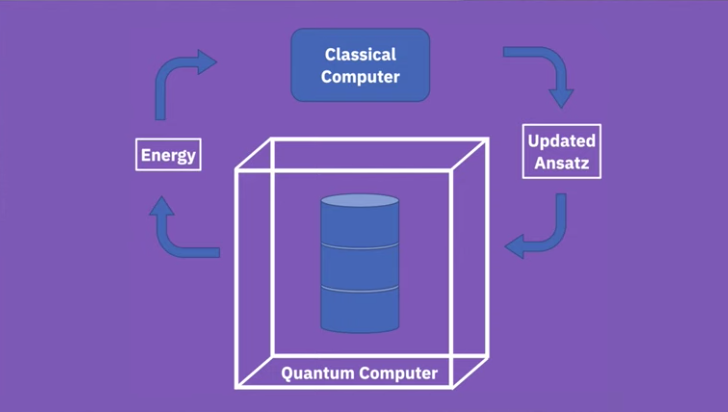
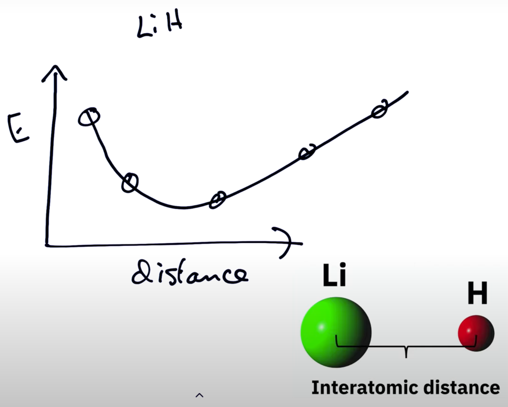

# Implementing the Variational Quantum Eigensolver (VQE) Algorithm Using [Cirq](https://quantumai.google/cirq/)

This VQE implementation with Cirq was put together for a final project for [CS 8395 - Special Topics: Introduction to Quantum Computing]() at [Vanderbilt University](https://vanderbilt.edu) taught by [Dr. Chuck Easttom](http://www.chuckeasttom.com/)

## Problem Statement

Choose an algorithm we have not covered and implement it in the programming language of your choice, along with a paper describing the algorithm, and explaining your choice of algorithm and programming language.

## Implementation 

You can find the custom implementation of VQE using `cirq` in the [`src` directory](src/__init__.py). There is an adjacent [`sample` directory] that contains sample code from the Google Quantum AI Documentation on VQE. This code was stripped back and rearchitected to be more expressive and object oriented in the custom implementation to make the flow of the VQE algorithm a bit more understandable. 

### Architecture  
The custom implementation in `src` follows an object-orientated architecture, using a [`VQEIsingSolver`](src/vqe_ising_solver/solver.py) class to encapsulate the logic of finding an Ising model ground state with VQE and a [`Driver`](src/main.py) class to Drive the instantiation of VQEIsingSolver instances to solve6 different instances of the Ising model, e.g., for varying grid sizes. Both of these classes inherit from a [`Base`](src/base.py) class for shared logging behavior. 

#### `VQEIsingSolver`
The [`VQEIsingSolver`](src/vqe_ising_solver/solver.py) class encapsulates the logic of the VQE algorithm specifically for solving an instance of the Ising model. The class itself as well as each method that it offers is heavily documented with explanations of how it relates to the logical flow of the VQE algorithm. The logic contained in the class is based on the Google Quantum AI documentation on VQE, but this implementation strips out the code from their documentation that is not needed, and reorganizes the important logic in a more expressive and object-oriented way such that the flow of the VQE algorithm is easier to understand.

### Running the Implementation
To run this project, take the following steps. 
1. Clone the repository and navigate into its root directory. 
2. Create a Python 3 virtual environment (`python3 -m venv venv`)
3. Install all of the requirements (`pip install -r requirements.txt`)
4. Navigate into the `src` folder (`cd src`)
5. Run the main module (`python main.py`)

## Variational Quantum Eigensolver (VQE)

Originally proposed by Peruzzo et al. in a 2014 Nature Communications paper [arXiv:1304.3061](https://arxiv.org/abs/1304.3061), the VQE algorithm is a NISQ algorithm (an algorithm designed to run on NISQ era quantum computers) that leverages both quantum and classical computation to solve the problem of finding a minimum eigenvalue of a Hermitian matrix. 

Knowing that we can model the Hamiltonian\footnote{The Hamiltonian operator $H$ of a quantum system is an operator representing the total energy of that system. The Hamiltonian is represented as a matrix, and the eigenvalues of that matrix are scalar energy levels.} of a given quantum system using a Hermitian matrix, this means we can use VQE to find the ground state energy (lowest-energy state) of that system since that ground state is represented by the Hamiltonian's lowest possible eigenvalue. 

A quantum system's ground state, or lowest-energy state, provides valuable information about its properties which can be utilized in simulating its behavior, and simulations allow us to better understand, predict, and exploit the behavior of physical systems. Simulating a system, quantum or otherwise, requires an understanding of how that system naturally evolves, and the lowest-energy state of a quantum system is the state to which the system tends toward naturally. As such, the ground state encodes important information about the system's lowest-energy configurations and internal interactions that offer significant value for simulation.

### Variational Quantum Algorithms (VQAs)

The VQE algorithm belongs to a larger class of Variational Quantum Algorithms (VQAs) which, [as described by Cerezo et al.](https://arxiv.org/abs/2012.09265), are designed to classically optimize parameterized quantum circuits (PQCs) --- that is, quantum circuits described by [Benedetti et al.](https://iopscience.iop.org/article/10.1088/2058-9565/ab4eb5) as trainable machine learning models. More specifically, a VQA takes a machine learning approach to quantum circuit optimization in that it defines a reusable, fixed-structure PQC with unchanging quantum gate types and iteratively runs that circuit many times with varying gate parameters, where changed parameters affect gate behavior and thus the measured outputs of the circuit. As an example, a PQC might have a parameter that controls the strength of a coupling between two qubits or a parameter that controls the angle of a rotation gate. By iteratively adjusting these parameters (e.g., with a grid search, which we also see in hyperparameter optimization of machine learning models \cite{liashchynskyi2019grid}), one can identify the specific set of parameter values that produce the best solution to the problem in question.

In the case of VQE, where the goal is to find the ground state of a quantum system, we aim to find parameter values that minimize the expectation value of the quantum system's Hamiltonian. Expectation values (EVs) essentially help us mathematically describe measurements in quantum systems; the expectation value of an observable is the average of all possible measurement outcomes for that observable weighted by their respective probabilities. The expectation value of the Hamiltonian calculated with some wave function $\psi$ is denoted $\langle \psi | H | \psi \rangle$ or simply $\langle H \rangle_{\psi}$. [The next section](#the-variational-principle) explains the principle behind this in more detail.

### The Variational Principle
The variational principle on which VQE is based states that for a given Hermitian matrix $H$ (e.g., the Hamiltonian of a quantum system), its expectation value calculated with a trial wave function $\psi$ (denoted $\langle H \rangle_{\psi}$) must always be greater than or equal to its minimum eigenvalue $\lambda_{\text{min}}$ where the minimum eigenvalue is equal to the ground state energy $E_0$ of the quantum system. This can be mathematically expressed as 

$$\lambda_{\text{min}} \leq \langle H \rangle_{\psi} \implies E_0 \leq \langle H \rangle_{\psi}$$

Note: A Hermitian matrix is a complex square matrix that is equal to its own conjugate transpose, meaning the element in the $i$-th row and $j$-th column is equal to the complex conjugate of the element in the $j$-th row and $i$-th column, for all indices $i$ and $j$.

We know that the Schrödinger equation describes how a given quantum system changes over time. With the time-independent version of that equation

$$H|\psi\rangle = E | \psi \rangle$$

the rate at which the system changes is constant and the solution to the equation consequently describes the allowed states of the system and their associated energy levels, which essentially equate to rules governing the system's behavior that can be used for simulating the system. 

The idea with VQE is to start with an initial educated guess (called the ``ansatz") for the trial wave function $\psi$, then use quantum computing to calculate the energy using that wave function, and then adjust that wave function using a classical optimizer, and repeat until the expectation value of the Hamiltonian $H$ converges to a minimum. That minimum value, once found, must be the ground state energy $E_0$ of the quantum system since the variational principle guarantees that $E_0$ is the lower bound for the energy. A diagram of this flow is depicted below. 

The key note here is that VQE uses **quantum computing** for calculating the energy but uses **classical computation** for optimizing variational parameters (the wave function). 

### How VQE Works 

To understand how the VQE algorithm works, let us consider a specific, simple problem: finding the interatomic distance of a lithium hydride (LiH) molecule.

In this simple case, we can make the interatomic distance of LiH a parameter of our PQC, with the goal being to find the distance that results in the lowest energy measurement. The figure below depicts an approximation of the energy profile of the molecule. 

At each distance, VQE computes the lowest energy. After all of those energy computations, the distance that resulted in the lowest(overall) energy is the actual interatomic distance of the molecule. 

The first thing we need in order to use VQE is an educated guess (an ansatz) for the trial wave function $\psi$ of LiH. Note here that creating this initial ansatz requires specific domain knowledge of the problem; we need to encode our molecule into a quantum state (qubits) in order to use quantum computing to calculate its energy, which means we need to be very familiar with the molecule. This mapping of the molecule into the quantum wave function (i.e., into qubits) will take into account properties like its molecular geometry, its electronic orbitals, and its electron count. 

Since we are interested in finding the molecule's interatomic distance (the unknown for this problem), we can parameterize the geometry property such that VQE will tell us which specific value of that property results in the lowest energy. First, though, we provide an educated guess for its value in our ansatz. Let our initial guess for the distance value be $D_0$. 

Next, the quantum computer will execute a series of measurements using our initial ansatz with distance $D_0$ to calculate the energy of the LiH molecule. 

After that, the energy measured is returned back to the classical optimizer which applies an update to the ansatz. Once the energy at this distance $D_0$ converges to a minimum value, VQE then moves to the next interatomic distance $D_1$ and repeats, as shown the VQE diagram above. 

The below section will provide information about the Cirq framework from Google and the motivation for using it and will subsequently provide a look at the implemented algorithm using that framework. 

\subsection{The Cirq Framework}
\label{subsection:thecirqframework}

[Originally announced in July of 2018](https://ai.googleblog.com/2018/07/announcing-cirq-open-source-framework.html) at the International Workshop on Quantum Software and Quantum Machine Learning by Google's AI Quantum Team, Cirq is an open source framework for NISQ quantum computers that allows researchers to investigate whether these computers can solve real-world computational problems. One uses the Cirq framework via the ``cirq" Python library which offers useful abstractions for writing, optimizing, and running quantum circuits either on simulators or real NISQ computers.

Cirq was chosen as the implementation tool for the VQE algorithm because of the extensive and [clear documentation](https://quantumai.google/cirq/experiments/variational_algorithm) offered by Google Quantum AI on the use of their Python library for such an implementation, as well as the library's overall expressiveness and ease of use. 

A supplemental implementation with Qiskit was also pursued in reference to their [own documentation](https://qiskit.org/textbook/ch-applications/vqe-molecules.html) but a number of issues were encountered due to rapid evolution of their ``qiskit" SDK for Python (specifically with Qiskit Aqua and Qiskit Nature) and its inconsistency with published resources and documentation. Nonetheless, apart from the implementation specifics, resources like IBM Quantum's [YouTube video](https://www.youtube.com/watch?v=Z-A6G0WVI9w) on the VQE algorithm provided useful theoretical insight on why the algorithm is useful and how to apply it to a specific problem like finding the interatomic distance of a molecule.

# Ising model Background for Cirq Implementation in [sample.py](sample.py)
Suppose you have a system of N atoms on a square lattice (grid). So the length and width of the grid is sqrt(N). 
Each atom can be in one of two possible states, e.g., spin up or spin down. 

Any two neighboring atoms are coupled by an interaction -J. A positive value for J favors parallel alignment of neighboring atoms (e.g., up up or down down). In other words, $J > 0 \implies \uparrow \uparrow \text{ or } \downarrow \downarrow, J < 0 \implies \uparrow \downarrow \text{ or } \downarrow \uparrow$. We can also think of a term to manipulate each atom individually. In the case of localized spins, this can be achieved by an external magnetic field $B$. In the presense of a magnetic field $B$, the magnetic moments will tend to align. 

This model can be described in terms of the following Hamiltonian: 

$$H = \frac{gs}{2} \mu_B B \sum_{i=1}^{N} \sigma_z^i - J \sum_{<i,j>}\sigma_z^i \sigma_z^j$$

where the first term represents the system coupling to the external magnetic field $B$, $gs$ is the spin-g factor, and $\mu_B$ is the Bohr magneton, and the second term represents coupling of neighboring atoms, a sum of all nearest neighbors, and the product of sigma matrices at atom $i$ and $j$. 

Note that the Hilbert space is spanned by all possible combinations of $\uparrow$ / $\downarrow$ at each atom. Therefore, the Pauli matrix $\sigma_z^i$ reads:

$$\sigma_z^i = | \uparrow \rangle_i \langle_i \uparrow | - | \downarrow \rangle_i \langle_i \downarrow |  $$

Another resource actually ignores the external magnetic field entirely and describes the total energy of the system as 

$$E_\mu = \sum_{<i,j>} -J \sigma_i \sigma_j =  -J \sum_{<i,j>} \sigma_i \sigma_j =$$

which only captures the coupling of neighboring atoms. That is, take each atom, get the spin direction of the atom to the up/down/left/right, sum that total, and add that to a global total for the full grid. 

